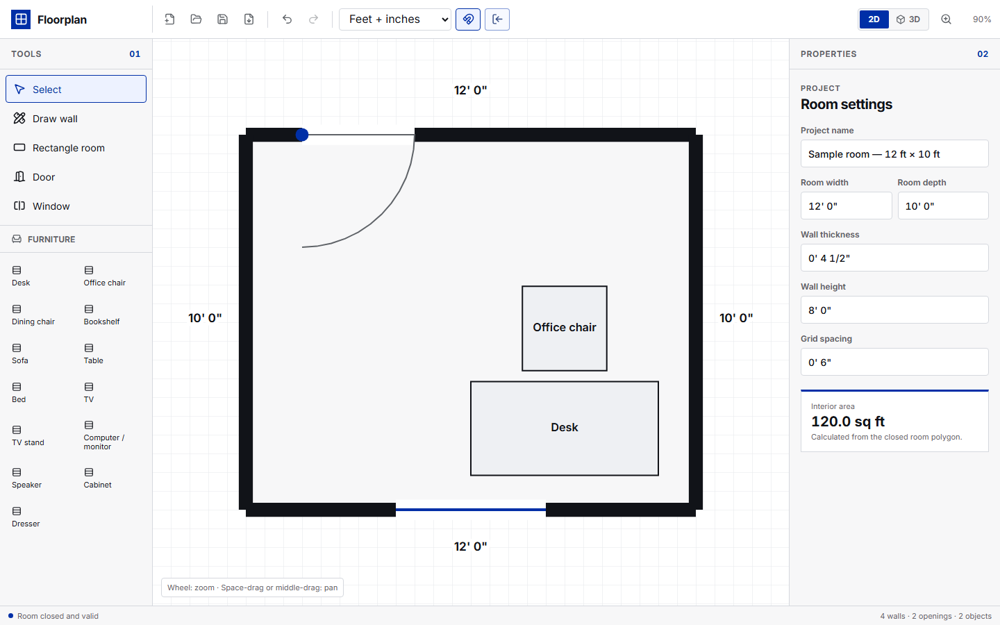
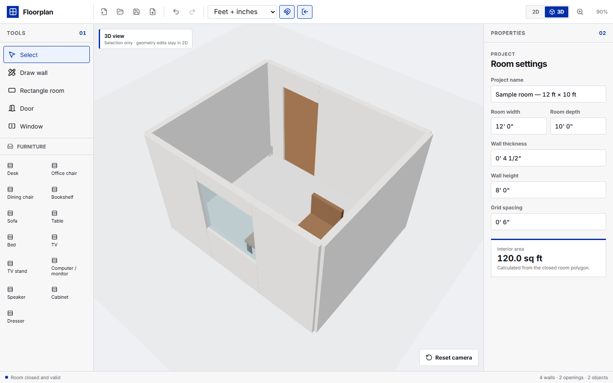

# Floorplan

Floorplan is a backend-free desktop-browser room planner for drafting one precise closed room in 2D and inspecting it in polished interactive 3D. Geometry is stored as integer thousandths of an inch and shared by the SVG editor, Three.js scene, project files, collision engine, and export pipeline.

## Features

- Connected-wall and click-drag rectangle drawing with live dimensions
- Conventional US measurement entry, including decimal feet, inches, mixed feet/inches, and fractions
- Start, Center, and End anchor policies for exact wall resizing
- Screen-space snapping for endpoints, closure, centers, edges, angles, alignment, and grid
- Parametric wall-hosted doors and windows with two-inch end clearance
- Collision-aware, resizable low-poly furniture catalog with advisory door-swing warnings
- Shared 2D/3D scene model with orbit, pan, zoom, selection, and reset-camera controls
- Portable versioned JSON projects plus three checksummed rotating IndexedDB recovery snapshots
- Clean or dimensioned SVG, US Letter vector PDF, and 3300×2550 PNG exports
- 100-command undo/redo history and keyboard shortcuts
- No backend, accounts, external model downloads, environment variables, or mounted configuration

## Browser support

The editing experience targets the latest two desktop releases of Chrome, Edge, Firefox, and Safari at viewport widths of 1180px or wider. Plain HTTP deployment on a LAN IP is supported: Floorplan uses native `crypto.randomUUID()` in secure contexts and an RFC 4122 UUID v4 fallback backed by `crypto.getRandomValues()` where `randomUUID()` is unavailable. Mobile editing, multiple rooms/floors, collaboration, DXF, and 3D export are outside the MVP.

## Local development

Requires Node.js 22 and npm.

~~~bash
npm ci
npm run dev
~~~

Open http://localhost:5173.

Validation commands:

~~~bash
npm test
npm run test:e2e:chromium
npm run lint
npm run build
~~~

Playwright projects are configured for Chromium, Firefox, and WebKit. Install all browser engines before running the complete matrix:

~~~bash
npx playwright install
npm run test:e2e
~~~

## Controls

| Input | Action |
| --- | --- |
| Wheel | Zoom toward the cursor, 10%–800% |
| Space + left drag | Pan the 2D canvas |
| Middle-mouse drag | Pan the 2D canvas |
| Shift while drawing | Constrain to the nearest 45° |
| Alt while drawing | Temporarily suspend automatic snapping |
| Alt + Shift | Keep only the intentional 45° constraint |
| Escape | Cancel the active drawing or drag mode |
| Delete / Backspace | Delete the validated selection |
| Ctrl/Cmd + Z | Undo |
| Ctrl/Cmd + Shift + Z or Ctrl + Y | Redo |

The 3D view supports orbit, pan, and zoom through standard pointer controls. Geometry movement and resizing remain in 2D; select a 3D object and use **Edit in 2D**.

## Project compatibility

Explicit saves download a project-name.floorplan.json file. Current files use schemaVersion 1; imports are fully validated before they replace the active project. Unsupported schemas, malformed measurements, broken references, invalid polygons, solid collisions, and overlapping openings are rejected with readable errors.

Changing the display unit affects formatting and input defaults only. All geometry remains integer LengthMils, where 1 inch equals 1,000 mils.

## Docker Compose

The root Compose file pulls the public multi-architecture image and requires no .env, substitutions, volumes, custom networks, secrets, or configuration mounts:

~~~bash
docker compose up -d
docker compose ps
curl http://localhost:8080/healthz
~~~

Open http://docker-host:8080. Plain HTTP LAN addresses are supported through the Web Crypto UUID fallback; HTTPS is not required for project creation. The container runs unprivileged Nginx on port 8080, serves SPA fallback routes, applies immutable caching to static assets, and exposes /healthz.

## Portainer

1. In Portainer, create a new stack and choose **Git Repository**.
2. Enter https://github.com/Packet7hrower/floorplan.git.
3. Select branch main.
4. Set the Compose path to compose.yaml.
5. Deploy the stack.
6. Open http://docker-host:8080.

Portainer pulls ghcr.io/packet7hrower/floorplan:latest; it does not build the application locally.

## Publishing

Pushes to main run lint, unit tests, the production build, and Chromium smoke tests before publishing public linux/amd64 and linux/arm64 images. Version tags such as v1.0.0 additionally publish semantic-version image tags.

The GitHub package must be configured as public after its first publish so anonymous GHCR pulls and Portainer deployments work without registry credentials.

## Licenses

Floorplan source code is available under the [MIT License](LICENSE). Inter is bundled under the SIL Open Font License 1.1; its full license is at [public/fonts/LICENSE.txt](public/fonts/LICENSE.txt). Other third-party notices are recorded in [THIRD_PARTY_NOTICES.md](THIRD_PARTY_NOTICES.md).
