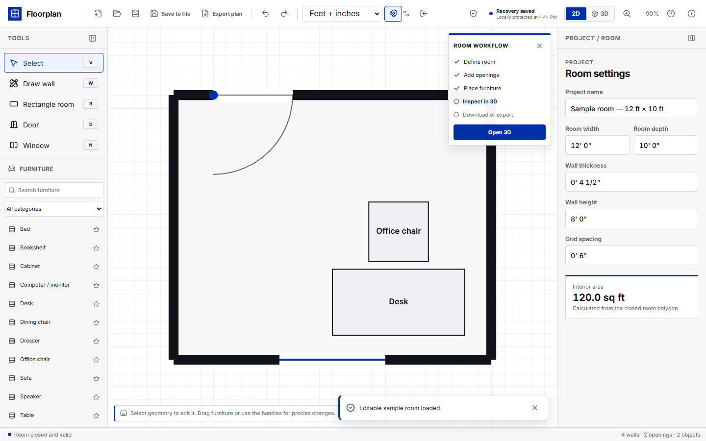
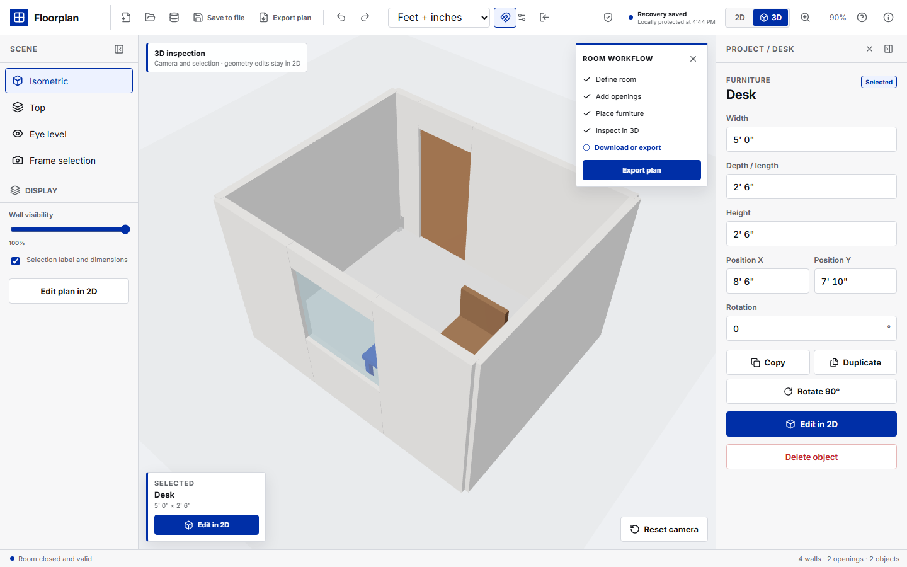

# Floorplan

Floorplan is a backend-free desktop-browser room planner for drafting one precise closed room in 2D and inspecting it in polished interactive 3D. Geometry is stored as integer thousandths of an inch and shared by the SVG editor, Three.js scene, project files, collision engine, and export pipeline.

## Features

- Measured, click-drag, and connected-wall room creation with a dismissible workflow guide
- Conventional US measurement entry, including decimal feet, inches, mixed feet/inches, and fractions
- Start, Center, and End anchor policies for exact wall resizing
- Screen-space snapping for endpoints, closure, centers, edges, angles, alignment, and grid, with locally stored snap preferences
- Parametric wall-hosted doors and windows with two-inch end clearance
- Collision-aware furniture with direct move/rotate/resize handles, keyboard nudging, duplication, search, categories, recents, and favorites
- Mode-aware 3D inspection with camera presets, synchronized selection, wall visibility, and direct return to 2D editing
- Portable versioned JSON projects, an IndexedDB local project library, and an inspectable three-snapshot recovery center
- Clean or dimensioned SVG, US Letter vector PDF, and 3300×2550 PNG exports
- 100-command undo/redo history and keyboard shortcuts
- Collapsible, keyboard-resizable workspace rails plus responsive File, Edit, View, and Help menus
- Recoverable startup surface, deferred 3D/export loading, explicit protection status, and build/capability diagnostics
- No backend, accounts, external model downloads, environment variables, or mounted configuration

## Browser support

The editing experience targets the latest two desktop releases of Chrome, Edge, Firefox, and Safari at viewport widths of 1180px or wider. Plain HTTP deployment on a LAN IP is supported: Floorplan uses native `crypto.randomUUID()` in secure contexts and an RFC 4122 UUID v4 fallback backed by `crypto.getRandomValues()` where `randomUUID()` is unavailable. Recovery checksums also have a browser-side fallback when `crypto.subtle` is restricted. Mobile editing, multiple rooms/floors, collaboration, DXF, and 3D export remain outside the product scope.

## Local development

Requires Node.js 22 and npm.

~~~bash
npm ci
npm run dev
~~~

Open http://localhost:5173.

Validation commands:

~~~bash
npm test
npm run test:e2e:chromium
npm run lint
npm run build
~~~

Playwright projects are configured for Chromium, Firefox, and WebKit. Install all browser engines before running the complete matrix:

~~~bash
npx playwright install
npm run test:e2e
~~~

## Controls

| Input | Action |
| --- | --- |
| Wheel | Zoom toward the cursor, 10%–800% |
| Space + left drag | Pan the 2D canvas |
| Middle-mouse drag | Pan the 2D canvas |
| Shift while drawing | Constrain to the nearest 45° |
| Alt while drawing | Temporarily suspend automatic snapping |
| Alt + Shift | Keep only the intentional 45° constraint |
| Escape | Cancel the active drawing or drag mode |
| Delete / Backspace | Delete the validated selection |
| Arrow keys | Nudge selected furniture or a wall-hosted opening |
| Shift + Arrow | Coarse nudge |
| Alt + Arrow | Fine nudge |
| Ctrl/Cmd + C | Copy selected furniture |
| Ctrl/Cmd + V | Paste copied furniture |
| Ctrl/Cmd + D | Duplicate selected furniture |
| ] | Rotate selected furniture 90° |
| Ctrl/Cmd + Z | Undo |
| Ctrl/Cmd + Shift + Z or Ctrl + Y | Redo |
| V / W / R / D / N | Select, wall, rectangle, door, or window tool |
| ? | Open the controls and workflow reference |

The 3D view supports orbit, pan, zoom, Isometric, Top, Eye level, Frame selection, wall visibility, and synchronized selection. Geometry movement and resizing remain in 2D; select a 3D object and use **Edit in 2D**.

## Project compatibility

Current files use schemaVersion 1; UI preferences, the local project library, and recovery metadata are stored separately and never enter project JSON. **Download project** creates a portable project-name.floorplan.json file. In supported secure contexts, **Save to file** progressively enhances this with a persistent browser file handle; plain-HTTP LAN deployments keep the complete download fallback.

**Open downloaded file**, **Open local projects**, **Download project / Save to file**, and **Export plan** are intentionally separate actions. Imports are fully validated before discard confirmation or replacement of the active project. Unsupported schemas, malformed measurements, broken references, invalid polygons, solid collisions, and overlapping openings open detailed diagnostics and leave the current project untouched.

Changing the display unit affects formatting and input defaults only. All geometry remains integer LengthMils, where 1 inch equals 1,000 mils.

## Docker Compose

The root Compose file pulls the public multi-architecture image and requires no .env, substitutions, volumes, custom networks, secrets, or configuration mounts:

~~~bash
docker compose up -d
docker compose ps
curl http://localhost:8080/healthz
~~~

Open http://docker-host:8080. Plain HTTP LAN addresses are supported through the UUID and recovery-checksum fallbacks; HTTPS is not required for project creation, local projects, recovery, downloads, or exports. Direct persistent file handles remain a secure-context enhancement, with project download used everywhere else. The container runs unprivileged Nginx on port 8080, serves SPA fallback routes, applies immutable caching to static assets, and exposes /healthz.

## Portainer

1. In Portainer, create a new stack and choose **Git Repository**.
2. Enter https://github.com/Packet7hrower/floorplan.git.
3. Select branch main.
4. Set the Compose path to compose.yaml.
5. Deploy the stack.
6. Open http://docker-host:8080.

Portainer pulls ghcr.io/packet7hrower/floorplan:latest; it does not build the application locally.

## Publishing

Pushes to main run lint, unit tests, the production build, and the complete Chromium, Firefox, and WebKit browser matrix before publishing public linux/amd64 and linux/arm64 images. Version tags such as v1.0.0 additionally publish semantic-version image tags.

The GitHub package must be configured as public after its first publish so anonymous GHCR pulls and Portainer deployments work without registry credentials.

## Licenses

Floorplan source code is available under the [MIT License](LICENSE). Inter is bundled under the SIL Open Font License 1.1; its full license is at [public/fonts/LICENSE.txt](public/fonts/LICENSE.txt). Other third-party notices are recorded in [THIRD_PARTY_NOTICES.md](THIRD_PARTY_NOTICES.md).
